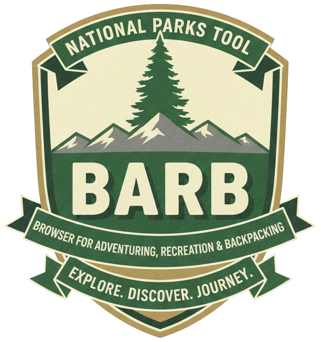

<p align="center">
  
</p>

# BARB API

[](https://barb-api-658225020507.us-central1.run.app/docs)
[](https://opensource.org/licenses/MIT)
[](https://www.python.org/downloads/)
[](https://fastapi.tiangolo.com/)
[](https://cloud.google.com/run)

Browser for Adventuring, Recreation, and Backpacking - A public API for National Parks Service data.

## Live API

🔗 **API Base URL:** https://barb-api-658225020507.us-central1.run.app

📚 **Interactive Documentation:** https://barb-api-658225020507.us-central1.run.app/docs

🌲 **Web App:** https://barbnps.com

## Overview

BARB API provides programmatic access to comprehensive National Parks Service data including parks, campgrounds, trails, activities, events, and more.

## Endpoints

- `GET /parks` - List all parks
- `GET /parks/{park_code}` - Get specific park details
- `GET /activities` - List park activities
- `GET /alerts` - Get park alerts
- `GET /campgrounds` - List campgrounds
- `GET /events` - Get park events
- `GET /hikes` - List hiking trails
- `GET /places` - Get places of interest
- `GET /tours` - List park tours
- `GET /boundaries` - Get park boundary data

All endpoints support filtering by `park_code` where applicable.

## Quick Start

### cURL Examples

Get all parks:
```bash
curl https://barb-api-658225020507.us-central1.run.app/parks
```

Get a specific park:
```bash
curl https://barb-api-658225020507.us-central1.run.app/parks/yose
```

Get alerts for Yosemite:
```bash
curl https://barb-api-658225020507.us-central1.run.app/alerts?park_code=yose
```

### Python
```python
import requests

# Get all parks
response = requests.get('https://barb-api-658225020507.us-central1.run.app/parks')
parks = response.json()

# Get specific park
response = requests.get('https://barb-api-658225020507.us-central1.run.app/parks/yose')
yosemite = response.json()

# Get campgrounds for a park
response = requests.get('https://barb-api-658225020507.us-central1.run.app/campgrounds?park_code=yose')
campgrounds = response.json()
```

### JavaScript
```javascript
// Get all parks
fetch('https://barb-api-658225020507.us-central1.run.app/parks')
  .then(response => response.json())
  .then(data => console.log(data));

// Get specific park
fetch('https://barb-api-658225020507.us-central1.run.app/parks/yose')
  .then(response => response.json())
  .then(data => console.log(data));

// Get campgrounds with async/await
async function getCampgrounds(parkCode) {
  const response = await fetch(`https://barb-api-658225020507.us-central1.run.app/campgrounds?park_code=${parkCode}`);
  const campgrounds = await response.json();
  return campgrounds;
}
```

## Response Format

All endpoints return JSON.

### Park Response
`GET /parks/yose`
```json
{
  "park_id": "77E0D7F0-1942-494A-ACE2-9004D2BDC59E",
  "park_code": "yose",
  "park_short_name": "Yosemite",
  "park_full_name": "Yosemite National Park",
  "park_description": "Not just a great valley, but a shrine to human foresight...",
  "full_address": "Yosemite National Park, CA",
  "google_maps_url": "https://maps.google.com/...",
  "apple_maps_url": "https://maps.apple.com/...",
  "latitude": 37.8651,
  "longitude": -119.5383,
  "park_url": "https://www.nps.gov/yose/index.htm",
  "plan_your_visit_url": "https://www.nps.gov/yose/planyourvisit/index.htm",
  "park_image_title": "Yosemite Valley",
  "park_image_caption": "View of Yosemite Valley from Tunnel View",
  "park_image_url": "https://www.nps.gov/...",
  "amenities_json": "{...}"
}
```

### Error Responses
```json
{
  "detail": "Park not found"
}
```
- `404` - Resource not found
- `422` - Validation error (invalid parameters)

### Query Parameters

- `park_code` - Filter by specific park (lowercase, e.g., `yose`, `grca`, `zion`)
- `limit` - Maximum number of results (default: 100, max: 1000)
- `category` - Filter alerts by category (alerts endpoint only)
- `emergency_only` - Boolean to show only emergency alerts (alerts endpoint only)

## Usage Guidelines

- **No authentication required** - The API is publicly accessible
- **No rate limits** - Currently no rate limiting enforced
- **Best practices** - Please cache responses when possible to reduce load

## Local Development

1. Install dependencies:
```bash
pip install -r requirements.txt
```

2. Set up environment variables in `.env`:
```
GCP_PROJECT_ID=your-project-id
DATASET_ID=your-dataset-id
GOOGLE_APPLICATION_CREDENTIALS=/path/to/service-account-key.json
```

3. Run the API:
```bash
uvicorn main:app --reload
```

4. Visit `http://localhost:8000/docs` for interactive documentation.

## Deployment

Deploy to Google Cloud Run:
```bash
gcloud run deploy barb-api \
  --source . \
  --region us-central1 \
  --allow-unauthenticated \
  --set-env-vars GCP_PROJECT_ID=your-project-id,DATASET_ID=your-dataset-id
```

## Contributing

Contributions are welcome! If you'd like to contribute:

1. Fork the repository
2. Create a feature branch (`git checkout -b feature/AmazingFeature`)
3. Commit your changes (`git commit -m 'Add some AmazingFeature'`)
4. Push to the branch (`git push origin feature/AmazingFeature`)
5. Open a Pull Request

Please ensure your code follows the existing style and includes appropriate documentation.

## Data Source

Data is primarily sourced from the National Parks Service API, with some data manually curated.

## License

MIT
